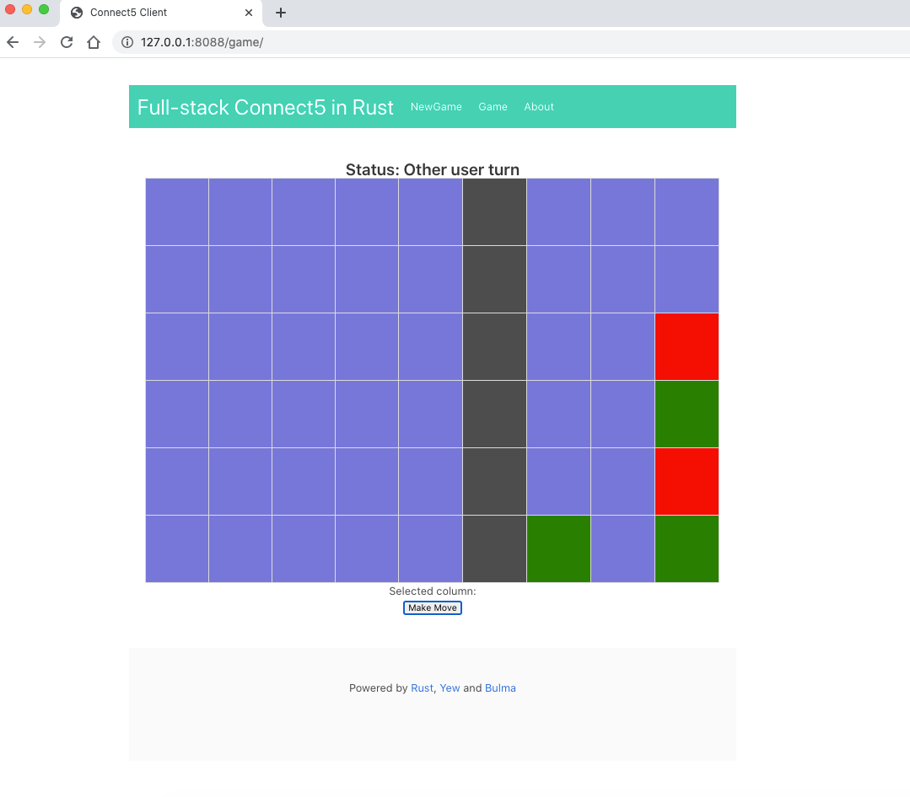

## Full-stack Rust with WebAssembly

# Look Ma, No JavaScript !!! 



My very first Rust project (implementation of the "Connect 5" game), I used as a learning tool.

My goal was to create some sort of a "reference implementation" of a Fullstack Rust application. Hopefully you will find it useful :).
Here you can find how to:
### Client:
- build Web client in Rust, without a single line of JavaScript, using  [Yew](https://github.com/yewstack/yew) WebAssembly framework
- use [yew-router](https://github.com/yewstack/yew/tree/master/packages/yew-router) for navigation between pages
- use multithreading components, communicating by "message passing" with Yew Agents
- use Yew StorageService to keep session data
- utilise a CSS framework ([Bulma](https://bulma.io))

### Server:
- Use [Actix Web](https://github.com/actix/actix-web) web framework to implement REST API
- [Diesel](https://diesel.rs) ORM with SQLite as default DB 
- Session cookies
- Integration testing for the REST API
- Mocking functions (db calls) in unit tests 


#### Usage:

Install trunk and build the client:
```
cd client
cargo install trunk wasm-bindgen-cli
trunk build -d ../server/static/ 
```

Start the server: 
``` bash
cd server
cargo run --package connect5-rust --bin connect5-rust
```
Open http://127.0.0.1:8088/ in your browser. Open a second session in another browser for player #2.


There are still few things that need to be improved/fixed, but the project served it's purpose (for me, at least) and is useful as it is, so I'll probably won't be fixing them. Feel free, however, to do so and may be create some PR(s) :)
